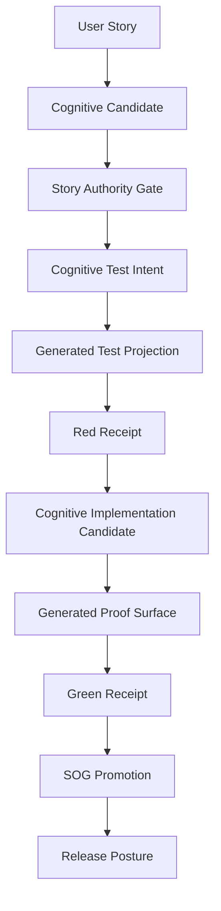

# Continuous Delivery Pipeline Conveyor

## What We Built

Yes. The completed slug arc is a continuous delivery conveyor for narrative execution.

It is not a traditional CI/CD pipeline that starts from hand-authored code. It starts from operator story intent, routes cognitive work through receipted AI providers, promotes authority only through gates, proves red/green, and accepts durable product truth only after Semantic Operation Graph (SOG) promotion.

The current vertical slice proves this path:

```text
operator story
-> live cognitive candidate
-> governed story/criteria/canonical authority
-> live cognitive test intent
-> generated test projection
-> red receipt
-> governed provider fallback implementation candidate
-> generated implementation proof surface
-> green receipt
-> SOG capability coverage
-> SOG execution
-> SOG parity
-> durable SOG promotion
```

## Conveyor Law

Each stage must hand off a packet to the next stage.

```text
Stage N consumes an accepted packet and receipt set.
Stage N performs one bounded transformation.
Stage N emits a new packet with artifacts, hashes, authority status, claims, blockers, and receipts.
Stage N+1 may consume only that accepted packet and its required receipts.
```

The packet is now first-class repo authority:

```text
contracts/schemas/conveyor-stage-handoff-packet.schema.v1.json
contracts/policies/conveyor-stage-handoff-packet-required.policy.v1.json
contracts/gates/conveyor-stage-handoff-packet-required.gate.v1.json
```

The slug conveyor is packetized here:

```text
conveyor/handoff-packets/story-slug/handoff-packet.index.v1.json
evidence/conveyor/story-slug.handoff-packetization.receipt.v1.json
```

## Stage Model



## Cognitive Stages

Cognitive stages create or refine meaning. They require live provider participation and receipts.

Examples:

```text
story.plan.live-gemini-candidate
story.test.cognitive-test-intent-promotion
story.implement.provider-fallback-candidate
```

Required evidence includes:

```text
provider dispatch
provider response
provider invocation receipt
provider identity
model identity
candidate artifact hash
freshness posture
mock/stale/fallback posture
```

Gemini remains the primary cognitive compiler path. Governed OpenAI fallback is allowed only when the primary provider failure is receipted and policy-authorized. Fallback supplies a candidate only; gates still decide.

## Deterministic Stages

Deterministic stages verify, materialize, execute, compare, or promote existing authority. They may not create new cognitive authority.

Examples:

```text
generated test materialization
red execution
generated implementation materialization
green execution
SOG capability coverage
SOG execution
SOG parity
SOG promotion
```

Required evidence includes:

```text
materialization receipt
test execution receipt
exit code
stdout/stderr hash
artifact hash
parity receipt
promotion receipt
blocker posture
```

## Authority Ladder

The slug packet index records this authority progression:

```text
candidate_only
-> promoted_authority
-> red_receipted
-> candidate_only
-> proof_surface_only
-> green_receipted
-> durable_truth
```

The important maturity line is:

```text
green is evidence
generated implementation is proof surface
SOG is durable product truth
```

## Current Packet Chain

```text
01-story-plan-candidate.packet.v1.json
02-story-authority.packet.v1.json
03-test-intent-authority.packet.v1.json
04-generated-test-red.packet.v1.json
05-implementation-candidate.packet.v1.json
06-implementation-proof-surface.packet.v1.json
07-green-proof.packet.v1.json
08-sog-promotion.packet.v1.json
```

Each packet declares:

```text
producedBy
consumedBy
authorityStatus
artifactRefs with hashes
requiredReceipts with hashes and expected statuses
providerParticipationRequired
deterministicVerificationRequired
blockedIfMissing
lineage
claims
guardrails
completionPosture
```

## Stress Lab Integration

The stress lab now treats the handoff packet index as required evidence for conveyor continuity.

```text
stress-lab/demo-suite.v1.json
contracts/schemas/story-stress-suite.schema.v1.json
contracts/cli/ndd-stress-run.command.v1.json
contracts/semantic-operation-graphs/cli/ndd-stress-run.execute.sog.v1.json
```

The stress run must block if packets are missing, invalid, missing required receipts, or claiming durable truth without SOG.

## Release Meaning

This conveyor can support continuous delivery because each stage emits a release-grade proof surface:

```text
what was consumed
what was produced
who or what produced it
whether cognition occurred
which provider participated
which receipts prove it
which artifacts were hashed
which authority status was granted
which claims are allowed
which blockers remain
who may consume the packet next
```

That is the continuous delivery shape we have built: not code-first automation, but semantic conveyor delivery with cognitive receipts, gates, red/green proof, SOG promotion, and handoff packets at every boundary.
